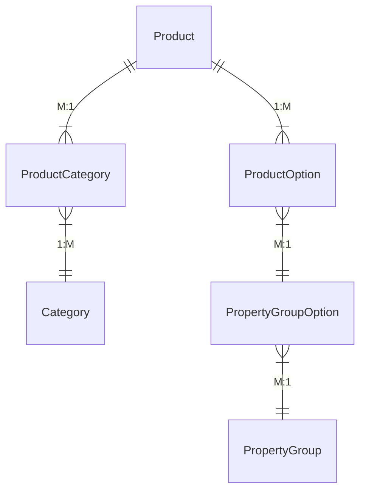

## What it is

Products are sellable entities (physical and digital) within a shop. Shopware can handle large product volumes, though very high counts (millions) need environment tweaks depending on category count, sales channel count, and product properties.

## Key steps / config

Products are understood through several facets:

- **Product details** — general information (title, product id, manufacturer, prices, etc.).
- **Product properties** — encapsulate property groups and options, shown on product detail pages, in listings, or used for filtering; a product can have arbitrarily many property group options.
- **Category** — a hierarchical grouping; a product can belong to multiple categories.

Entity relationships (elided):

**Product variant**: products are a self-referencing entity, interpreted as a parent-child relationship; this models variants and provides field-value inheritance from parent to child products.

- **Properties** are non-variant-defining facts shared across variants (e.g. product series/collection, washing instructions, manufacturing country).
- **Options** are variant-defining facts that differ per variant (e.g. shirt size, color, container volume).

## Essential identifiers

- Store API (configurator scoping)
- property group / property group option
- product variant (self-reference via parent id)

## Gotchas

It is critical to distinguish *properties* (non-variant-defining) from *options* (variant-defining) — both relate a product to a property group option entity, but only options constitute product variants.
