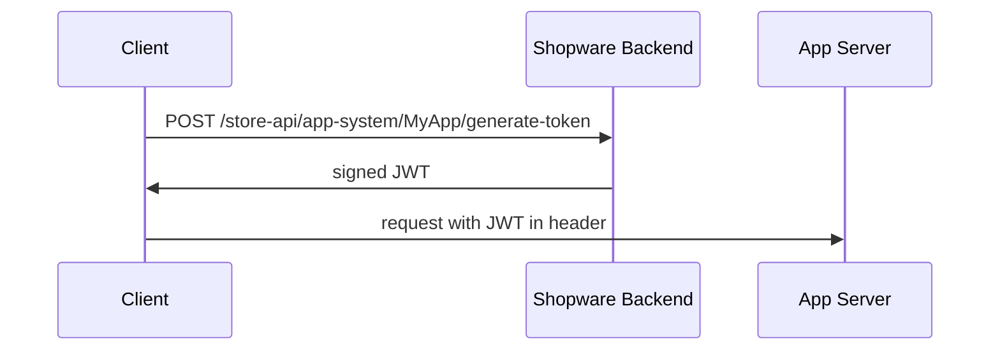

## What it is

Explains how the Storefront (browser) can talk directly to an app's backend server using a signed JSON Web Token issued by Shopware, without routing through Shopware's server.

## When to use

When client-side code needs session-specific data (customer, currency, language, country, sales channel) delivered securely to the app backend, e.g. for a product-review widget calling its own backend.

## Key steps / config

The client requests a token with `POST /store-api/app-system/{name}/generate-token` (or `/app-system/{name}/generate-token`); Shopware responds with a signed JWT, which the client then sends to the app server in a request header.

The JWT is signed with `SHA256-HMAC` using the app secret; `iss` is the shopId from registration. Claims (`languageId`, `currencyId`, `customerId`, `countryId`, `salesChannelId`) are only populated when the app holds the matching read permission, e.g. `sales_channel:read` for `salesChannelId`.

Storefront JS has a helper client: `import AppClient from 'src/service/app-client.service.ts'`, then `new AppClient('MyAppName')` exposes `.get/.put/.post/.patch/.delete(url, options)` which handle token generation for you. Manually, fetch the token endpoint and send it as the `shopware-app-token` header plus `shopId` as `shopware-app-shop-id`.

Your app backend must allow CORS, e.g. `Access-Control-Allow-Origin: *`, `Access-Control-Allow-Methods: GET, POST, OPTIONS`, `Access-Control-Allow-Headers: shopware-app-shop-id, shopware-app-token`. With the App PHP SDK, resolve via `$contextResolver->assembleStorefrontRequest($serverRequest, $shop)` and read `$storefront->claims->getCustomerId()`. With the Symfony Bundle, a controller can type-hint `StorefrontAction $webhook` directly.

## Essential identifiers

- `/store-api/app-system/{name}/generate-token`, `/app-system/{name}/generate-token`
- `shopware-app-token`, `shopware-app-shop-id` headers
- `AppClient` (storefront JS service)
- `Shopware\App\SDK\Context\Storefront\StorefrontAction`
- `assembleStorefrontRequest()`

## Gotchas

The JWT can only be generated while the browser user is logged in. Claims are omitted whenever the app lacks the corresponding read permission for that entity.
