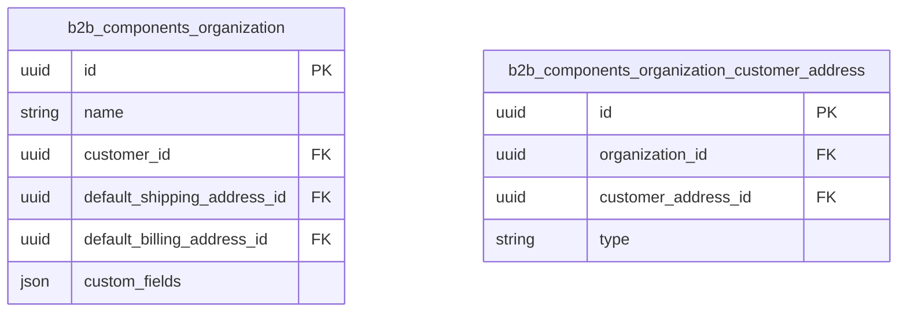

## What it is

Describes the two entities behind the Organization unit component: the organization itself and the join entity that links customer addresses to an organization.

## Key steps / config

- The **Organization** entity has a name, belongs to a customer, and defines a default billing address and a default shipping address chosen from the customer's addresses. It can have multiple employees and assigned payment/shipping methods, which govern checkout options for its employees.
- The **Organization Customer Address** entity links a customer address to an organization and records whether the address is used for billing or shipping.

## Essential identifiers

- `b2b_components_organization`
- `b2b_components_organization_customer_address`
