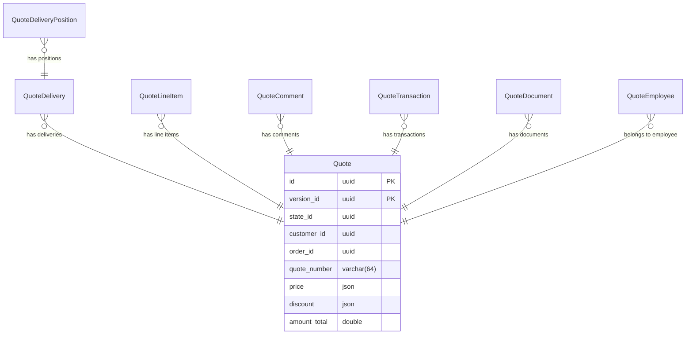

## What it is

Describes the entities behind Quotes Management and how they relate.

## Key steps / config

- **Quote** — state, pricing, discount, associated users/customer.
- **Quote Delivery** — shipping method, earliest/latest shipping date for a quote.
- **Quote Delivery Position** — line items of a quote delivery: quote line item, price, total price, unit price, quantity, custom fields.
- **Quote Line item** — line items of a quote; only product type is currently supported.
- **Quote Transaction** — payment amount, plus an external reference.
- **Quote Comment** — comments related to a quote.
- **Quote Employee** — employees associated with a quote.
- **Quote Document** — documents associated with a quote.

## Essential identifiers

- `Quote`, `QuoteDelivery`, `QuoteDeliveryPosition`, `QuoteLineItem`
- `QuoteTransaction`, `QuoteComment`, `QuoteEmployee`, `QuoteDocument`
