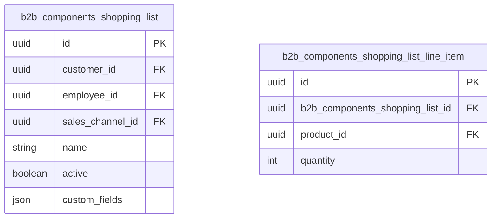

## What it is

Describes the two entities behind the Shopping lists component.

## Key steps / config

- **Shopping Lists** — a list of products prepared for a customer or a sales channel, showing name, customer and sales channel.
- **Line item** — represents each individual product within a shopping list.

## Essential identifiers

- `b2b_components_shopping_list`
- `b2b_components_shopping_list_line_item`
